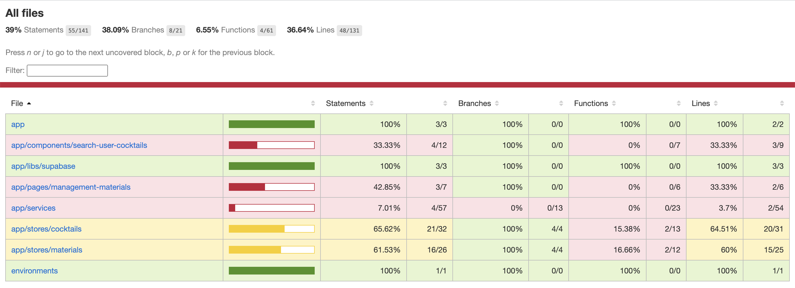

# Angular

### インストール

1. 何はともあれ yarn のインストール

   ```bash
   npm install -g yarn
   ```

2. Angular CLI のインストール

   ```bash
   yarn add @angular/cli
   ```

### プロジェクトの作成

1. 新規プロジェクトの作成

   ```bash
   ng new $PROJECT_NAME
   ```

1. Angular ルーティングを追加するか？と聞かれる、１ページ完結でなければ基本的に Yes。

   ```bash
   Would you like to add Angular routing?
   ```

1. 使用する CSS のフォーマットを選択する。

   ```bash
   ? Which stylesheet format would you like to use?

   CSS
   ❯ SCSS [ https://sass-lang.com/documentation/syntax#scss ]
   Sass [ https://sass-lang.com/documentation/syntax#the-indented-syntax ]
   Less [ http://lesscss.org
   ```

### コンポーネントの生成

以下のコマンドでコンポーネントやサービスの作成を行う。

```bash
ng g component /$DIRECTRY/$COMPONENT_NAME
ng g service /$DIRECTRY/$SERVICE_NAME
```

### ルーティング設定

1. ルーティングルールの作成
   app-routing.module.ts の routes を以下のように編集する。

   ```ts
   const routes: Routes = [
     {
       path: "",
       component: MainComponent,
     },
   ];
   ```

2. ルートコンポーネントの編集
   app.component.html に`<router-outlet>`をセットすることでルーティング設定に基づき、パスに応じたコンポーネントが表示される。

   ```html
   <router-outlet></router-outlet>
   ```

   

### ディレクトリ構成

```text
|-app
| |-stores
| |-models
| |-components
| | └-search-user-cocktails
| |-pages
| | └-main
| |-services
| └-libs
|-environments
└-assets
```

#### pages

URL を持つトップレベルのコンポーネントを配置する。

#### components

URL を持たないコンポーネントを作成する。
コンポーネントが増えてきたら画面ごとに整理する。

#### models

モデルクラスを定義する。

#### service

ビジネスロジックを定義する。
サービスが増えてきたら画面ごとに整理する。

#### libs

外部ライブラリ疎通用の設定や Client ファイルを格納する。

#### stores

今回は Ngrx を使用するため、Store の Action, selecter, state を配置する。

### 自動テスト

Angular のテストは標準で搭載されている Jasmin + Karma を使用する。
テストは最初に書かないと一生書かないので環境構築が終わったらまず、カバレッジ 100％にする。

#### 自動テストの実行

以下コマンドで実行する。

```ts
ng test
```

また、coverage のオプションを付与することで、karma.conf.js 内で指定したディレクトリ内にカバレッジのレポートを出力する。

```ts
ng test --code-coverage
```



### カバレッジ除外対象の設定

1. angular.js の test の箇所に カバレッジから除外するコンポーネントの記載する

   ```json
   "test": {
       "codeCoverageExclude": ["src/app/pages/main/**"]
   }
   ```

### 自動テストの記載方法

## Prettier

1. インストール

   ```bash
   yarn add prettier -D
   ```

2. 設定ファイルの作成

   設定ファイルを作成しない場合は、デフォルトのルールが適応されるが、個別設定したい場合は「.prettierrc」を追加して記載する。

- [Options](https://prettier.io/docs/en/options.html)

## ESLint

1. インストール

   ```bash
   yarn add eslint -D
   ```

2. 設定ファイルの作成

   「.eslintrc」を作成し、prettier と連携する。

   ```bash
   touch .eslintrc
   ```

   ```bash
   {
       "extends": ["eslint:recommended", "prettier"]
   }
   ```

## Angular Material

### インストール

```bash
ng add @angular/material
```

分析を Google に送るかなので、どちらでも。


インストールするバージョンこれでいいすか？ => Y


使用するテーマの選択。後で設定し直せるので適当に。


強調設定をグルーバルで使用するか。
後で設定(ry


アニメーションを使用するか。
後で(ry


### AngularMaterial コンポーネントの使用

1. 使いたい Module を app.module.ts の imports に記載する。

   ```ts
   import { MatButtonModule } from '@angular/material/button';

   @NgModule({
    imports: [
        BrowserModule,
        AppRoutingModule,
        BrowserAnimationsModule,
        MatButtonModule,
    ],
   })
   ```

2. Angular テンプレート内にコンポーネントを記載する。

   ```html
   <button mat-raised-button color="primary">TestButton</button>
   ```

## Ngrx

<https://ngrx.io/>

- Flux 思想に基づいた Angular の状態管理ライブラリであり、Angular で Redux ライクな状態管理ができる。
- Redux は Effect（副作用）が使えないため、非同期処理を行うには Redux-Thunk や Redux-Saga を使用する必要があるが、Ngrx は Angular 標準で搭載されている非同期処理用ライブラリ RxJs の Observable を使用して非同期処理を行うことができる。

<https://ngrx.io/docs>

### NgRx のデータフロー


## NGSX

<https://www.ngxs.io/>

- Ngrx よりさらに後発の Flux 思想状態管理ライブラリ。
- Ngrx をベースにクラス構文やデコレータなどの最新の TypeScript の機能を用いることでボイラープレートを減らしている。
- Ngrx を導入するなら基本こちらを導入した方が良い。

### Ngxs のデータフロー


### 使い方

1. インストール

   ```bash
   yarn add @ngxs/store -D
   ```

1. Action を実装する

   > @todo

1. state を実装する

   > @todo

1. dispach 処理を記載する

   > @todo

1. selecter を記載する

   > @todo

1. Store モジュールのインポート

   import する際は Store で管理する State を配列で渡す。

   ```ts
   import { NgxsModule } from '@ngxs/store';

   @NgModule({
   imports: [
       NgxsModule.forRoot([]),
   ],
   })
   ```

## Supabase

<https://app.supabase.io/>

### 環境構築

<https://supabase.com/docs/guides/with-angular>

1. インストール

   ```bash
   yarn add @supabase/supabase-js
   ```

1. environment.ts の設定

   ```ts
   export const environment = {
     production: false,
     supabaseUrl: "YOUR_SUPABASE_URL",
     supabaseKey: "YOUR_SUPABASE_KEY",
   };
   ```

1. supabaseClient を作成する。

   ```ts
   import { createClient } from "@supabase/supabase-js";
   import { environment } from "src/environments/environment";

   const supabaseUrl = environment.supabaseUrl;
   const supabaseAnonKey = environment.supabaseKey;

   export const supabase = createClient(supabaseUrl, supabaseAnonKey);
   ```

   supabase の機能を使用する場合はこの supabaseClient を import して使用する。

   ```ts
   import { supabase } from "src/app/libs/supabase/supabase-client";
   ```

### DB アクセス

1. Supabase から情報を取得する関数を作成する。

   Supabase に対して Query を実行すると Promise が帰ってくるため、疎通の関数は非同期関数とする。

   ```ts
   /**
     * Supabaseから材料リストを取得する
     *
     * @returns 材料リスト
     */
    private async getMaterialsListFromSupabase(): Promise<MaterialModel[]> {
      // @note Supabaseに接続
      let { data: materialList, error } = await supabase
        .from<MaterialModel>('v_material')
        .select('*');

      if (error) {
        console.log(error);
      }

      return materialList ? materialList : [];
    }
   ```

1. Promise を Observable に変換。

   今回は Observable 前提の状態管理ライブラリである NGXS を使用するため、Promise\<T\>の Supabase レスポンスを、Observable\<T\> に変換する必要がある。

   ```ts
   /**
   * 取得したPromise<MaterialModel[]>をObservable<MaterialModel[]>に変換する
   *
   * @returns Observable<MaterialModel[]>
   */
   getMaterialsList(): Observable<MaterialModel[]> {
    return defer(async () => {
      return await this.getMaterialsListFromSupabase();
    });
   }
   ```
