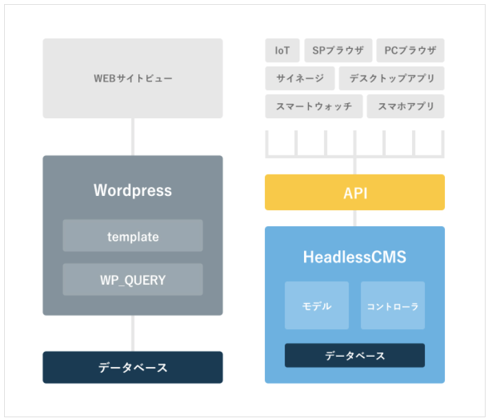

# HeadlessCMS

## 概要

- Viewの部分が存在しないCMS(Content Management System)であり、バックエンドの機能のみを持っている。
- SelfHost: 自前サーバー上にCMSを構築する。
- CaaS PaaS: クラウド常にサーバ、DBが存在しているマネージドなCMS。
  

[引用元](https://wk-partners.co.jp/homepage/blog/hpseisaku/htmlcss/headless-cms/)

## メリット

- フロント側の自由とが高い。
- バックエンド側はWebAPIを使用するためAPIを叩けるデバイスであれば、マルチなプラットフォームに対応できる。
- サイトの一部機能にピンポイントで使用することもできる。

## デメリット

- フロントエンドが全て自前
- プレビュー環境を作るのが大変
- APIのセキュリティ対応は慎重に

## どんなのがある

### CaaS型

- Contentful
  - もっとも知られたHeadless CMSの1つであるContentful。
  - 開発の幅の広いCMSで、Spotify、WeWorkなどの有名企業にも支持されています。markdown記法が使用できるほか、画像を自動でリサイズして渡してくれる機能など、様々なニーズに対応しています。
  - APIでのやりとりを楽にしてくれるSDK（Software Development Kit）や、様々な環境でのデプロイ方法のチュートリアルなども充実。コミュニティが大きいため、たくさんの開発事例を参考にすることができますよ。

- Prismic.io
  - Prismic.ioの魅力は無料枠。1ユーザーのみが使う管理画面であれば無料で契約でき、機能をほとんどフルで使用できます。個人などの小規模サイトにはもっとも向いているCMSの1つです。
  - またダッシュボードの UIも完成度が高く、軽快に動作します。注意点としては、テキストにmarkdownが使用できず、リッチテキストのみとなるところや、チュートリアルの読み解きに他のCMSより少し知識が必要になるところが挙げられます。

- Cosmic
  - CosmicはRESTとGraphQLの両方をサポートしているCMSです。強力なAPIや、他のアプリケーションと連携するWebhookの機能が充実しており、開発者にとっての扱いやすさが特徴です。
  - また、公式サイトで公開されているデモも、普通のブログからブラウザで動作するRPGゲームなど、多岐にわたっていて見ているだけでも楽しいです。無料枠もありますが、どちらかといえば大規模な導入に対応するプランが充実しています。

- GraphCMS
  - GraphQLの活用に特化したHeadless CMSです。RESTful APIを提供していませんが、GraphQLの長所を引き出すための、豊富なフィルターオプションやバッチ処理などが充実しています。REST中心のContentfulとよく比較されることもあり、開発事例や紹介記事は多く見つかります。
  - システム自体はシンプルで扱いやすく、テスト環境も充実していますが、GraphQL自体が、動画などの大きなバイナリデータなどを扱うことを苦手としている部分もあり、複雑なモデル設計をするのは少し大変かもしれません。

- Micro CMS
  - 日本製のHeadless CMSです。ネイティブな日本語の管理画面や、日本語でのチャットサポートが利用できるのはやはり快適。また、画像のWebP変換や、コンテンツの編集画面上で、そのコンテンツをAPIから呼んだ結果がプレビューできるなど、細かな機能も気が利いている印象です。
  - また、無料枠でもコンテンツ数やAPIリクエスト数は無制限。比較的新しいサービスなので、日々アップデートが行われていますよ。現状はRESTful APIのみが利用できるようです。

- Flamelink
  - Google の提供する BaaS サービスである Firebase を利用し、Headless CMS サイトを構築するサービスです。Firebase と Flamelink が字面的に少し似ているのでややこしいですが別のサービスです。利用には当然 Firebase との連携が必要となります。
  - 普段から Firebase を利用している企業であればシナジーを見込むことができるでしょう。
  - 無料プランも提供されていますので試しに触りやすい環境でもあります。

### Self-Hosted型

- Ghost
  - ブログに特化した、Node.jsで動作するオープンソースのHeadless CMSです。ブログに必要な機能を厳選しているため、動作が軽快で、管理画面のシンプルなUIにも定評があります。投稿のエディタがWordpressのものに似ており、慣れた方には扱いやすいのも特徴です。
  - オープンソースのソフトウェアなので、サーバやDBを自前で用意すれば無料で利用できますが、CaaSも展開しており、有料プランで快適に利用することができますよ。

- Strapi
  - 関心が急上昇中のStrapi。Node.jsで動作するCMSですが、たった1行のコマンドで開発環境を構築し、管理画面の表示まで行なえる「クイックスタート」が特徴。RESTful APIをベースにしていますが、公式プラグインでGraphQLにも対応可能です。
  - コアには最低限の機能のみ搭載し、公式プラグインで拡張していく、という考え方で設計されているため、カスタムの幅が広く、ローカルで自作のプラグインを搭載することも可能です。Self-Hosted型ならではの拡張性の高さがウリのCMSとなっています。

- Directus
  - Directusは、データベースとのやりとりを主眼においたPHPベースのHeadless CMSです。より厳密には、SQLデータベースをRESTful APIにラップするためのソフトウェア。イメージとしては、phpMyAdminのようなGUIを持つデータベース管理ツールを、API開発向けに発展させたものと言えるでしょう。DB構造が独特なものに固定されがちな CMSと違い、柔軟なデータ設計による効率の向上が見込めます。
  - Apache、MySQL、PHPの環境が推奨されていますが、Node.js、Ruby、Python、Javaなどと連携させるためのSDKも充実していますよ。またクラウド版もリリースされており、有料でCaaSとして使うことも可能です。

- Netlify CMS
  - Netlify CMSは静的サイトジェネレーター向けのCMSです。Netlifyとは、GitHubなどにあるソースコードをもとに、ビルド・デプロイ・ホスティングを自動で行なってくれる静的サイト向けのサービス。そこにCMS機能を追加できるのがNetlify CMSです。
  - APIを公開するのではなく、Gitリポジトリから静的なサイトをあらかじめビルドするので、ブラウザでの閲覧時にはAPIとの通信は発生しません。そのためSEO対策の観点からはグッド。
  - Netlify CMSの管理画面で投稿を作成すれば、 連携するGitリポジトリにコミットされ、自動でビルドがかかってサイトが更新されます。Netlify CMSはReact製のため、同じくReact製のサイトジェネレーター・Gatsbyとの相性も抜群。手順にそえば、ものの数十分でゼロからサイト公開が可能です。
